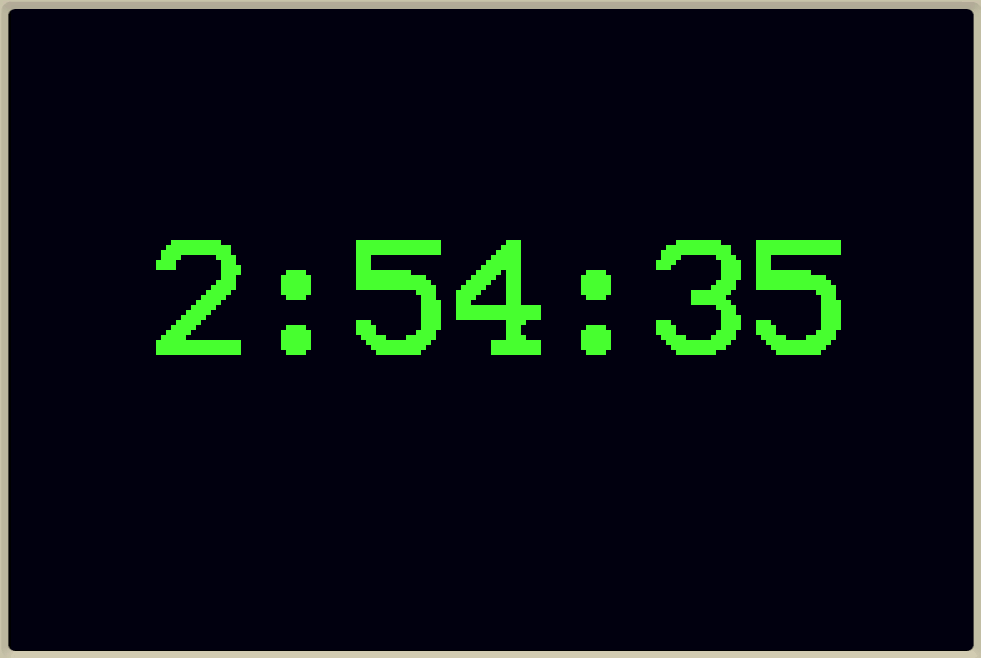

# Make a giant clock

Tags: minimicro

Use Mini Micro to make a giant digital clock you can read from across the room!  The numbers should be over 100 pixels high, like this:

Show the time with hours, minutes, and seconds, and automatically update every second.

Hints

The trick to drawing the giant text is to use [gfx.print](https://miniscript.org/wiki/PixelDisplay.print) with the "large" font, *and* to scale up the pixel display by a factor of 5 with `gfx.scale = 5`.

To get the current time, import the `dateTime` module, and call `dateTime.now` with an argument like `"HH:mm:ss"` (for hours, minutes, and seconds).

Finish with a main loop that uses `wait` to redraw the current time every second.

