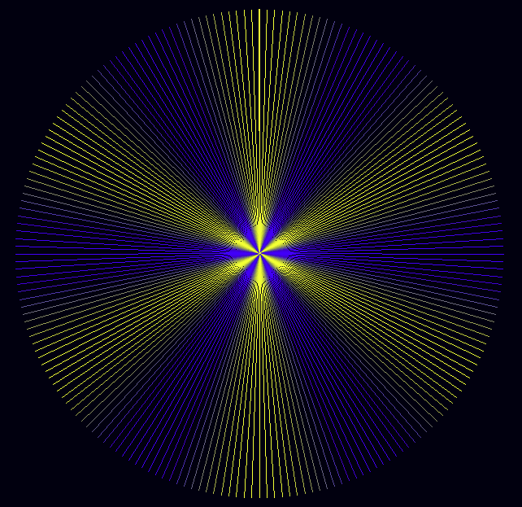

# Make a starburst Moire

Tags: minimicro

A _moiré pattern_ is an interesting pattern that can appear when you draw a series of lines close together on a display with limited pixel resolution.  Write a Mini Micro program to produce this specific pattern:

This has 200 lines, evenly spaced around a circle 300 pixels in radius.  The colors interpolate between yellow and blue six times around the circle.

Hints

- Use a `for` loop to iterate between `0` and `2*pi` in 200 steps.
- Use `cos` and `sin` to calculate the amount of x and y (on a scale of -1 to 1) there is at each angle.
- Multiply these by the radius, and add to your center point, to find the endpoint of the line.
- For the color, use `cos` again... but this time, multiply your angle by 6, so that the value cycles six times over the course of the loop.
- To interpolate between two colors, use `color.lerp`.

