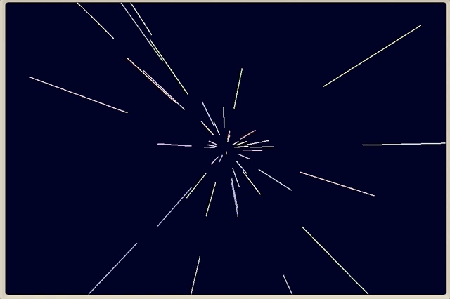

# Warp Speed

Tags: minimicro

Pilot your Mini Micro faster than light with this dazzling animated display!

The display consists of 50 lines, each in a random color.  They start near the center of the screen and rapidly grow outward.  When each line has completely left the screen, it is reset in the center, giving the illusion of an infinite stream of stars streaking past.

Hints

Keep track of each line with either a little map or a list of numbers.  In either case, you'll need five numbers per line: the x and y coordinates of each end, plus the color.  The x and y coordinates should be balanced around 0,0 (i.e., sometimes negative and sometimes positive).

The "inner" end of the line should actually be some constant fraction of the outer end of the line, such as half.  So technically you wouldn't have to store these; you could just compute them when you draw.

Loop over the lines, drawing each one with `gfx.line`.  Then make them grow by multiplying each coordinate by 1.1, and if the inner Y value becomes > 320 or < -320, reset the line back to the center.

Remember to [`yield`](https://miniscript.org/wiki/Yield) within your main loop!

If you're still having trouble, you can find an implementation of this task on page 39 of [Introduction to Computer Programming](https://www.amazon.com/dp/1736167618).

