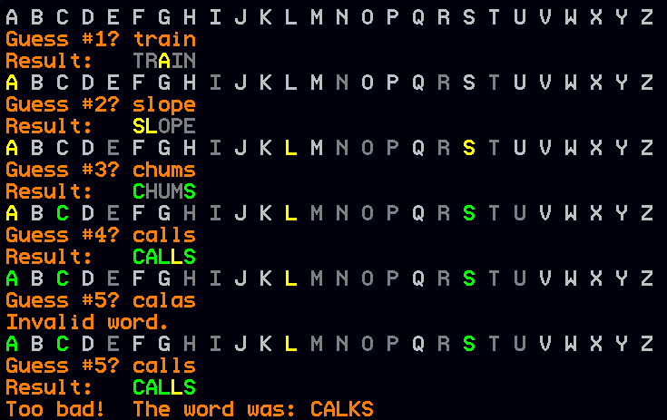

# Wordle!

Tags: minimicro, farmtronics

Recreate the 2022 hit word game [Wordle](https://en.wikipedia.org/wiki/Wordle) in MiniScript!

In this game, the computer picks a secret 5-letter word.  You get five guesses, each time entering a real 5-letter word (non-words are not allowed).  The game gives you the following feedback on your guess:

- any letter that is in the secret word, and at the same position within the word, is drawn in green
- any letter that is in the secret word, but in a different position, is drawn in yellow
- any letter that doesn't occur in the secret word is drawn in gray.

Implement this game in Mini Micro or Farmtronics!  It should take less than 100 lines of code.

Hints

Read `/sys/data/englishWords.txt`, and filter it down to just the 5-letter words.  Pick a random secret word, but keep the full list (of 5-letter words) for validating the user's input.

Prepare a little map to keep track of the status of each letter.  You can use color strings for each status; perhaps `color.lime` for correct, `color.yellow` for right letter but wrong position, and `color.gray` for incorrect.  Initialize all letters to `color.silver`, meaning not guessed yet.

Next, you'll need a function to print a set of letters in a color determined by that map.  Use this to print out the alphabet before each guess.

In your main loop, let the user enter a word.  Make sure that it's in the list of 5-letter words.  Then, iterate over the letters.  If it matches the secret word letter at the same position, color and print it green.  If it doesn't, but occurs in the secret word anywhere, color and print it yellow.  Otherwise, color and print it gray.

If they've guessed the word, print a success message; and if they haven't but they've used up all five guesses, print failure (and reveal the secret word).

If you need still more help, or want to compare your solution to an "official" one, there is a [Coffee Break Coding video](https://youtu.be/tsrz95G7hl8) implementing this task.

